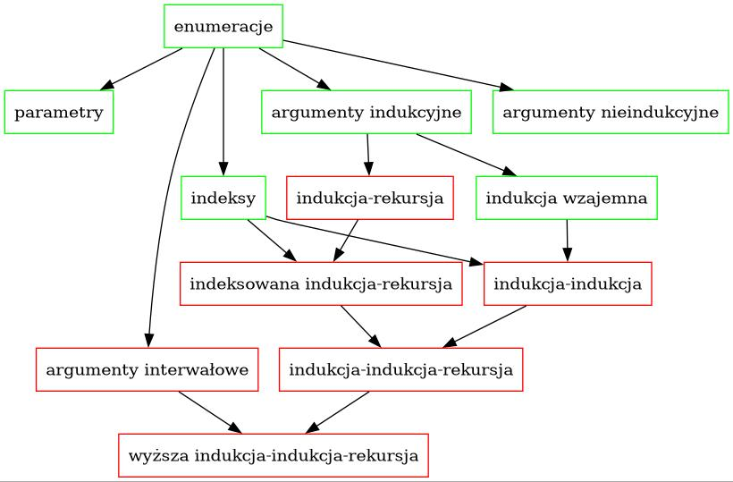

# Notatki dot. indukcji

Krótkie wyjaśnienia dot. tego, co dzieje się na powyższym obrazku. Prostokąty oznaczają różne formy ewolucji typów induktywnych. Zielone to te, które są dostępne w Coqu, a czerwone to te, które nie są dostępne.

Strzałka z A do B oznacza, że A jest konceptualnym prerekwizytem B, tzn. B nie może istnieć bez istnienia A. Dla przykładu: indukcja-indukcja umożliwia definiowanie jednocześnie dwóch typów, przy czym pierwszy jest indeksem drugiego i mogą się ona nawzajem do siebie odnosić w konstruktorach. To pokazuje, że pojęcia indukcji wzajemnej oraz indeksu (czyli indeksowanych rodzin typów) są konceptualnie wcześniejsze, niż mechanizm definiowania typów przez indukcję-indukcję.

## Objaśnienie obrazka

- Enumeracje to najprymitywniejsze stadium. Jedyne co możemy definiować, to typy skończone o wygodnych nazwach.
- Argumenty nieindukcyjne pozwalają nam wrzucić do enumeracji jakieś przydatne rzeczy.
- Parametry umożliwiają głownie polimorfizm i definiowanie wielu typów o takim samym kształcie na raz (np. opcja na A).
- Indeksy dają możliwość definiowania rodzin typów.
- Argumenty indukcyjne umożliwiają nam robienie najprymitywniejszych typów induktywnych, takich jak liczbyn naturalne.
- Indukcja wzajemna pozwala zdefiniować skończoną liczbę typów, których konstruktory odnoszą się do siebie nawzajem.
- Indukcja-indukcja pozwala zdefiniować skończoną sekwencję typów, przy czym wcześniejsze mogą być indeksami późniejszych.
- Indukcja-rekursja pozwala zdefiniować jednocześnie odnoszące się do siebie nawzajem typ i funkcję, której dziedziną jest ten typ. Zauważmy, że funkcja może być zdefiniowana jedynie przez rekursję prymitywną, czyli jej struktura musi dokładnie pasować do definicji typu.
- Indeksowana indukcja-rekursja dorzuca do powyższego możliwość indeksowania.
- Indukcja-indukcja-rekursja pozwala jednocześnie zdefiniować sekwencję (rodzin) typów, z których wcześniejsze mogą być indeksami późniejszych, oraz funkcje zdefiniowane na tych typach przez rekursję prymitywną.
- Argumenty interwałowe pozwalają robić ścieżki między elementami danego typu, czyli typy przestają być zbiorami, a stają się przestrzeniami.
- Wyższa indukcja-indukcja-rekursja to połączenie wszystkiego, co bozia dała. Jedyny pierścień, jednym słowem.

## Symulacja (ale bez symulakrów)

Detal, którego nie widać na obrazku, jest taki, że niektóre formy indukcji mogą symulować inne, np.:
- indeksowane rodziny typów mogą symulować indukcję wzajemną
- indukcja-rekursja może symulować indeksowane rodziny typów
- indeksowane rodziny mogą symulować małą indukcję-rekursję (czyli taką, gdzie dziedzina funkcji nie jest sortem).

## Zastosowania

Żeby było milej, każda z powyższych form ewolucji ma jakieś swoje sztandarowe zastosowania.

| Forma ewolucji                | Zastosowanie
| ----------------------------- |-------------------------|
| enumeracje                    | enumeracje                    |
| arg. nieindukcyjne            | dużo                          |
| parametry                     | polimorfizm                   |
| indeksy                       | predykaty i relacje           |
| arg. indukcyjne               | liczby naturalne              |
| indukcja wzajemna             | zagnieżdżone typy induktywne, np. Tree i Forest |
| indukcja-indukcja             | teoria typów w teorii typów   |
| indukcja-rekursja             | uniwersa                      |
| indeksowana indukcja-rekursja | metoda Bove-Capretta          |
| indukcja-indukcja-rekursja    | rekursja ogólna dla funkcji z indukcji-rekursji |
| arg. interwałowe              | sklejanie punktów typu        |
| wyższa indukcja-indukcja-rekursja | cuda na kiju, np. uniwalentne uniwersa, teoria typów gdzie równość to konwertowalność |

## Rząd

Jeszcze jedna kwestia, która nie zmieściła się na obrazku, a która konceptualnie jest warta podkreślenia: argumenty indukcyjne mogą być finitarne  (tzn. argument postaci I) lub infinitarne (tzn. argument postaci A -> I dla jakiegoś typu A).

## Nazwy

O ile niektóre formy ewolucji są niezależne od innych (np. parametry są niezależne od w sumie wszystkiego), to zazwyczaj występują razem (np. w sumie wszystko zazwyczaj ma możliwość używania parametrów). Prowadzi to do nadawania osobnych nazw poszczególnym grupom, co podsumowuje tabelka.

| Nazwa                     | Co tam jest                   |
| ------------------------- | ----------------------------- |
| Typy algebraiczne         | enumeracje, parametry arg. nieindukcyjne, arg. indukcyjne |
| GADTs/rodziny indeksowane | typy algebraiczne + indeksy   |
| wyższe typy induktywne    | enumeracje, parametry, arg. nieindukcyjne, indukcyjne i interwałowe |

## Indukcja a rekursja

Niektórym formom indukcji z obrazka odpowiadają dość ściśle jakieś formy rekursji, a innym nie.

| Indukcja                      | Rekursja                      |
| ----------------------------- |------------------------------ |
| enumeracje                    | dopasowanie do wzorca         |
| arg. nieindukcyjne            | wiązanie argumentów we wzorcach |
| parametry                     | -                             |
| indeksy                       | zależne dopasowanie do wzorca |
| arg. indukcyjne               | rekursja prymitywna           |
| indukcja wzajemna             | rekursja wzajemna             |
| indukcja-indukcja             | ?                             |
| indukcja-rekursja             | indukcja-rekursja?            |
| indeksowana indukcja-rekursja | ?                             |
| indukcja-indukcja-rekursja    | ?                             |
| arg. interwałowe              | trochę innowacji jest, ale nie wiem, jak je opisać |

Żeby było jeszcze skomplikowaniej, to (przynajmniej w Coqu) niektóre formy rekursji nie odpowiadają żadnej formie indukcji.

| Rekursja                      | Skąd się bierze               |
| ----------------------------- | ----------------------------- |
| strukturalna                  | termination checker pozwala   |
| dobrze ufundowana             | rodziny induktywne (bo Acc)   |
| monotoniczna                  | fix po prostu tak działa      |
| ogonowa                       | po prostu można tak           |
| wyższego rzędu                | zagnieżdżone typy induktywne  |

## Problemy

Turbo poważnym problemem jest brak spójności w nazywaniu różnych form rekursji, np.:
- rekursja zagnieżdżona bierze swoją nazwę od zagnieżdżania fixów jeden w drugim
- rekursja wyższego rzędu bierze nazwę stąd, że... w sumie nie wiadomo, ale ma to związek z tym, że wywołanie rekurencyjne nie jest w pełni zaaplikowane, czyli funkcja jest argumentem innej funkcji, czyli tamta funkcja jest funkcją wyższego rzędu... skomplikowane
- rekursja strukturalna bierze nazwę od tego, że argument główny jest strukturalnie mniejszy
- rekursja ogonowa bierze nazwę z jakichś kompilatorowych slangów

Inny problem jest taki, że to co na obrazku nazywa się rekursją prymitywną, pozwala w szczególności (np. używając zagnieżdżania) zrobić funkcję Ackermanna, która nie jest prymitywnie rekurencyjna według bardziej klasycznego znaczenia tego terminu. Wobec tego przydałby się inny termin... albo i nie - wprowadźmy więcej konfuzji.

## Nazwy wesoło hasające w stajni Augiasza

Niestety, ale nazwy różnych rodzajów rekursji są dość niejednolite i przypadkowe i to na tyle, że zdarzyło mi się nazwać dwa zupełnie niepowiązane rodzaje rekursji rekursją zagnieżdżoną - pierwszy z nich ma zagnieżdżone wywołania rekurencyjne, a drugi zagnieżdża jeden fix w drugim.

Podziały rekursji ze względu na:
- sposób ustalenia terminacji:
  - rekursja prymitywna
  - rekursja strukturalna
  - rekursja ogólna
- postać wywołania rekurencyjnego:
  - rekursja zagnieżdżona
  - rekursja wyższego rzędu