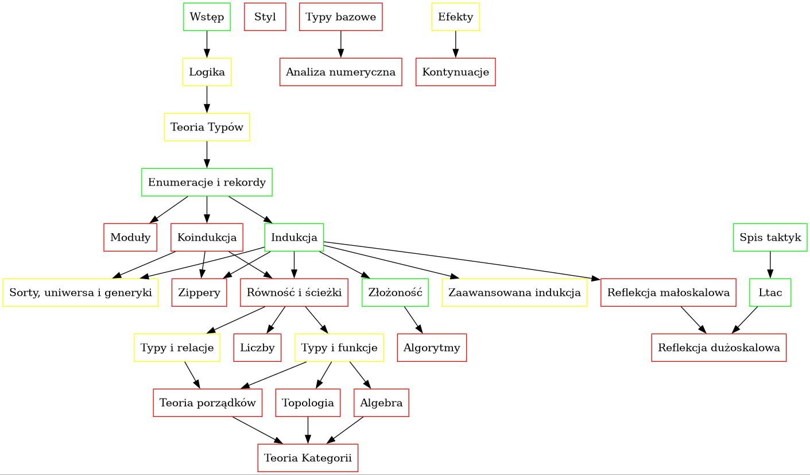
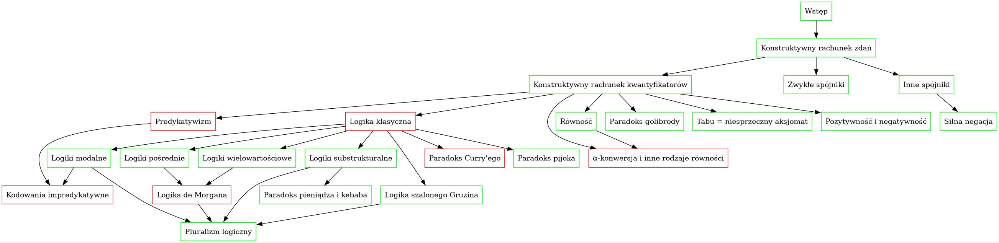

# Plan

## Część 0

### A: Wstęp i inne tego typu pierdoły

## Część 1: Logika

### B1: Konstruktywny rachunek zdań.
- Spójniki:
  - Implikacja:
    - rozumowanie "od tyłu" - `apply`
    - rozumowanie "do przodu" - `specialize`
    - rozumowanie od tyłu jest lepsze, logika jest bezmyślna
  - Dysjunkcja
  - Koniunkcja
  - Fałsz i prawda, w tym jako 0-arna wersja dysjunkcji i koniunkcji
  - równoważność
  - negacja, silna i słaba
- Paradoks pieniądza i kebaba
- Zadania:
  - zadania wstawić do tekstu, a na koniec dać tylko te, które łączą wiele spójników.
  - dodać zadanie dotyczące czytania twierdzeń i dowodów
  - dodać zadania dotyczące czytania formuł (precedencja etc.)
- Ściąga
  
### B2: Konstruktywny rachunek kwantyfikatorów.
- Typy i ich elementy (zestawić ze sobą `P : Prop`, `A : Type`, `p : P`, `x : A`)
- Predykaty i relacje
- Równość
- Kwantyfikatory:
  - uniwersalny
  - egzystencjalny
  - unikatowy
- Zmienne związane
- Paradoks golibrody
- Zadania:
  - modelowanie różnych sytuacji za pomocą zdań i predykatów
  - rozwiązywanie zagadek logicznych
  - więcej zadań z exists
- Ściąga

### B3: Różne inne rzeczy
- (Im)predykatywizm - krótki opis.
- Kodowanie impredykatywne
- Kombinatory taktyk
- Taktyka firstorder

### B4: Logika klasyczna
- Prawa logiki klasycznej - enumeracja, krótki opis, podział na grupy (LEM, materialna implikacja i równoważność) vs DNE vs (Peirce, consequentia mirabilis) vs kontrapozycja
- Logika klasyczna jako logika:
  - Boga (LEM) + prawo zachowania informacji
    - metoda zerojedynkowa
  - materialna
  - diabła (DNE i kontrapozycja)
  - cudownych konsekwencji, Peirce'a
- Paradoks pijoka
- Paradoks Curry'ego
- (Paradoksy implikacji materialnej?)
- Zadania:
  - udowodnij równoważność praw każde z każdym
  - wyrzucić zadania mącące (mieszające typy i zdania)
- Ściąga

### B5: Inne logiki
- Porównanie logiki konstruktywnej i klasycznej
- Inne spójniki, np. xor. Ćwiczenie kreatywności?
- Inne logiki:
  - {sub, super}-intuicjonistyczne
  - modalne
  - substrukturalne
  - wielowartościowe
  - logika szalonego Gruzina
- Logiki pośrednie:
  - opisać pojęcie tabu
  - logika słabego wyłączonego środka
  - logika de Morgana jako coś pomiędzy logiką konstruktywną i klasyczną
  - Goedel-Dummet
  - Przesuwanie podwójnej negacji
- Logika modalna
- Pluralizm logiczny
- Zadania:
  - rozwiąż wszystkie zadania jeszcze raz, ale tym razem bez używania Module/Section/Hypothesis oraz z jak najkrótszymi dowodami
- Jakieś podsumowanie
- Zrobić test tak/nie.
- Zrobić fiszki do nauki nazw praw.

## Część 2: teoria typów, czyli programowanie

### C0: Dedukcja naturalna
- Trzy rodzaje reguł
- Dedukcja naturalna (z kontekstami, bez prooftermów)
- Obfite ćwiczenia, czyli to samo co w zeszłym rozdziale, ale na drzewkach wyprowadzeń
- Dedukcja naturalna (z kontekstami i prooftermami)
- Znowu to samo, czyli obfite ćwiczenia, drzewka + prooftermy
- Potem znowu to samo, ale same prooftermy (oczywiście pisząc "prooftermy" mam na myśli takie z regułami, a nie z pattern matchingiem)
- Jeżeli komuś nie chce się robić miljort razy tego samego, to kluczowym minimum jest opanowanie posługiwania się anonimowymi funkcjami (czyli prooftermami dla implikacji) - można je bardzo dogłębnie przećwiczyć robiąc ręczne dowody wszystkiego na zdaniach zdefiniowanych za pomocą kodowań impredykatywnych. Być może zajmujący się tym podrozdział jest tak ważny, że należałoby go przenieść do właściwego rozdziału o logice

### C1: Podstawy teorii typów
- Curry-Howard
- Pięć rodzajów reguł
- Omówić obliczenia i postacie normalne (wystarczy z grubsza, nie trzeba jakoś mega dokładnie)
- HoTT-bookowa teoria typów: pusty, unit, bool, nat, produkt, suma, funkcje, produkt zależny, suma zależna, uniwersa, równość
- Ale nie można zaniedbać formalnej prezentacji teorii typów.
- Wprowadzić tutaj nazwę "motyw eliminacji"
- Pozytywność i negatywność

### D: Indukcja

### D0: Enumeracje i rekordy
- Enumeracje, czyli sumy nazwane.
  - Proste enumeracje
    - Przykładowe typy: kierunki, kolory RGB, dni tygodnia, uprawnienia dostępu (R, W, RW, etc.), pusty, unit
    - Kontent: pattern matching i ewaluacja (to co obecnie jest przy opisie typu `bool`). 
    - Ćwiczenia: logika boolowska. Dokładnie wszystko opisać i powiązać z logiką klasyczną
  - Argumenty nieindukcyjne
    - Przykładowe typy: nie wiem, coś się wymyśli
    - Kontent: wiązanie argumentów we wzorcach
    - Ćwiczenia: typ-driven design, czyli jakieś głupoty w stylu "wymodeluj typ reprezentujący korporancje"
  - Parametry
    - Przykładowe typy: `prod`, `sum`.
    - Kontent: polimorfizm i parametryczność, a raczej jej brak
    - Ćwiczenia: typ `option`.
  - Enumeracje indeksowane
    - Przykładowe typy: `BoolSpec`
    - Kontent: jak się zachowuje pattern-matching przy indeksach (źle)
    - Ćwiczenia: maszyny stanowe!
- Rekordy, czyli produkty nazwane
  - Rodzaje rekordów: induktywne, koinduktywne, primitive projections

### D1: Typy induktywne
- Konstruktory rekurencyjne.
  - Kontent: rekursja. Przykładowe typy: `nat`
  - Ćwiczenia: arytmetyka Peano.
- Indukcja wzajemna.
- Indeksy, czyli predykaty i relacje
- Indeksy v2, czyli typy danych ostro chwycone za mordę.
- Indukcja-rekursja.
- Indukcja-indukcja.
- Indukcja-indukcja-rekursja.
- Zadania z definiowania induktywnych typów i predykatów
- W międzyczasie: omówić ścisłą pozytywność
- Dodać podrozdział o typach induktywnych z nieskończoną ilością argumentów indukcyjnych (`A -> T`)

### D2: Definiowanie funkcji
- Rekursja:
  - "prymitywna" (jak w Agdzie)
  - strukturalna
  - polimorficzna
  - "monotoniczna" (fix w fiksie)
  - paliwowa
  - dobrze ufundowana
- metoda Bove-Capretta
- metoda Bove-Capretta z indeksowaną indukcją-rekursją

### D3: Logika boolowska, rozstrzygalność, ślepota boolowska, reflekcja małoskalowa, evidence-based programming i być może jeszcze jakieś inne tego typu czary
- Tabelki prawdy (definicje) + twierdzenia jako powtórka logiki klasycznej.
- Różnice między `bool`, `Prop` i `SProp`
- Aksjomaty dotyczące sortu `Prop` i jak obejść się bez nich.
- Rozstrzygalność:
  - Co to.
  - Techniczne aspekty.
  - Kiedy nie rozstrzygać (protip: kiedy można niskim kosztem rozstrzygnąć coś bardziej informatywnego).
  - `reflect`, `BoolSpec`, `CompareSpec` etc.
  - Uwaga: w sumie to taki typ sumor jest dla opcji czymś analogicznym jak `BoolSpec` dla typu `bool`.
- Boolean blindness
- Reflekcja małoskalowa
- Napisać podrozdział poświęcony temu, czy definiować predykaty (i rodziny typów) przez rekursję czy przez indukcję. Użyć jako przykładu takich predykatów jak `elem`, `Exists`, `Forall`, `Exactly`. Jak to się ma do rozstrzygalności
- Evidence-based programming, czyli silne specyfikacje.
- Metoda encode-decode, początkowo jako narzędzie do rozwiązywania problemów, których normalni ludzie nie mają i nigdy mieć nie będą. Potem: izomorfizmy typów. PYTANIE: czy metoda encode-decode przypadkiem się nie zawieruszyła?

### D4: Arytmetyka Peano

### D5: Listy
- ogólnie trzeba będzie zrobić gruntowny refaktoring list według planu zawartego w List_sig.v

### D6: Więcej list
- Alternatywne definicje predykatów i relacji
- Rozstrzyganie predykatów i relacji
- Generowanie różnych rodzajów (pod)struktur typu prefiksy, podciągi etc.
- Wszystko o permutacjach

### D7: Ogólne plany na rozdziały X:
- boolowska logika ternarna, być może jako tour de force dla automatyzacji? albo test kreatywności
- typ `option` (być może przy okazji funktory?) Stąd zadania dla `head`, `last`, `tail` i `init`
- wcisnąć tu rozdział o produktach, sumach i funkcjach?
- arytmetyka i typ `nat`. Reszta arytmetyki:
  - liczby dodatnie (positive)
  - binarne liczby naturalne
  - liczby całkowite
  - liczby wymierne
  - systemy liczbowe
- `list`y i ich różne pochodne:
  - listy niepuste `nel`
  - wektory zależne `vec`
  - wektory podtypowe (jak w ssreflekcie)
- drzewa ukorzenione:
  - binarne węzłowe `BTree`
  - binarne liściowe (wisienki)
  - ogólne węzłowe `Tree`
  - ogólne liściowe `RoseTree`
  - jakieś inne? (węzłowe niepuste)

### F: Koindukcja
- F1: Typy koinduktywne - rekordy, parametry i korekursja
- F2: liczby konaturalne
- F3: strumienie
- F4: kolisty
- F5: kodrzewa

### G: Sorty, uniwersa (kodów) i generyczność
- Programowanie generyczne za pomocą uniwersów
- Jedyny pierścień wyższego rzędu, czyli W-typy i M-typy
- Jedyny pierścień pierwszego rzędu, czyli uniwersa kodów na typy induktywne i koinduktywne
- Uwaga: wyższy rząd vs pierwszy rząd

### G2: Zippery

### G3: Zaawansowana indukcja

## Cześć 3: Metapoziom, czyli taktyki

I1: Ltac
  - być może przenieść tu z rozdziału 1 fragment o kombinatorach taktyk
  - `Ltac` się zestarzał, opisać `Ltac2`

I2: Spis taktyk
  - nieopisane taktyki: `induction`, `inversion`, `destruct`
  - przerobić "drobne taktyki" na "taktyki do zarządzania kontekstem"
  - przenieść opis taktyki `pattern` (i odpowiadające zadanie) do części o taktykach dla redukcji
  - Taktyki dla redukcji i obliczeń: Mamy następujące redukcje:
    - alfa (zmiana nazwy jednej zmiennej związanej)
    - beta (podstawienie argumentu za parametr formalny w jednym miejscu)
    - delta (odwinięcie jednej definicji) — uwaga: to w sumie nie jest
      relacja, tylko rodzina relacji parametryzowana/indeksowana nazwami,
      które chcemy odwinąć
    - eta - unikalność dla funkcji, rekordów etc.
    - iota (wykonanie jednego dopasowania do wzorca)
    - zeta (redukcja pojedynczego `let`a)
  - Odpowiadające taktyki:
    - alfa — brak
    - beta — `cbn beta`/`cbv beta`
    - delta — `cbn delta`/`cbv delta`, `unfold`, `fold`
    - eta — brak
    - iota — `cbn iota`/`cbv iota`
    - zeta — `cbn zeta`/`cbv zeta`
    - ogólna redukcja: `cbn`, `cbv`, `simpl`
    - konwersja: `change`
  - Omówić następujące taktyki (w kolejności):
    - `pattern` (beta ekspansja)
    - `unfold`, `fold` (delta redukcja/ekspansja)
    - `change` (konwertowalność)
    - `cbn`
    - `compute`, `vm_compute`, `native_compute`
    - `cbv`, `lazy`
    - `red`
    - `simpl`
    - `hnf`

I3: Reflekcja, metapoziom, quote (którego oczywiście w Coqu nie ma, a jak) i inne takie duperele
  - Z cyklu "panie, a na co to komu?": po co prostemu chłopu reflekcja?
  - Semantyka vs składnia

## Część 4: Efekty obliczeniowe dla biedaków

L0: Funktory, w tym aplikatywne

L1: Monady i efekty jako sposoby bycia
- `Id` nie reprezentuje żadnego efektu. Wartości typu `Id A` są w ten
  sposób, że po prostu są.
- `option` reprezentuje częściowość. Wartości typu `option A` są w ten
  sposób, że albo są, albo ich nie ma
- `sum E` reprezentuje możliwość wystąpienia błędu. Wartości typu
  `sum E A` są w ten sposób, że albo są poprawne, albo ich nie ma, gdyż
  wystąpił błąd typu `E`.
- `list` reprezentuje niedeterminizm (uporządkowany). Wartości typu
  `list A` są w ten sposób, że może ich być wiele lub może ich nie być
  wcale i są w sposób uporządkowany.
- `State S` reprezentuje stan. Wartości typu `State S A` są w ten
  sposób, że są i mają pamięć, tzn. mogą się zmieniać w zależności
  od stanu.
- `Reader R` reprezentuje możliwość odczytania konfiguracji.
- `Writer W` reprezentuje możliwość zapisywania logów.
- `Future` reprezentuję asynchroniczność. Wartości typu `Future A`
  są w ten sposób, że albo są teraz, albo będą później.
- `STM` reprezentuje transakcje. Wartościu typu `STM A` są w ten
  sposób, że są w jednym kawałku, są transakcjami.
- `SQL` reprezentuje operacje bazodanowe. Wartości typu `SQL A` są
  w ten sposób, że albo po prostu są, albo są w bazie danych.

### L2: Kontynuacje
- Kodowanie Churcha
- Kodowanie Scotta
- Listy różnicowe
- nawiązać do rekursji ogonowej

## Część 5: Funkcyjna algorytmika

### K1: Złożoność
  - Napisać coś o rekursji ogonowej i opisać poświęcone jej techniki dowodzenia.

### K2: Algorytmy i struktury danych:
  - sortowanie
  - drzewa wyszukiwań
  - sterty

## Część 6: HoTTowa matematyka

### H1: Ścieżki
- Interpretacja homotopiczna: dowody równości a ścieżki
- Opowiedzieć skąd się biorą ścieżki
- Ścieżki w banalnych typach
- Ścieżki między sumami
- Ścieżki między parami
- Ścieżki między elementami typów induktywnych
- Ścieżki między elementami typów koinduktywnych
- Ścieżki między funkcjami
- Ścieżki między zdaniami - `PropExt`
- Ścieżki między typami - uniwalencja
- Proof Irrelevance
- Aksjomat K
- Aksjomat Uniwalencji
- Aksjomaty w stylu ProofIrrelevance, UIP, K, PropExt
- Wyższe typy induktywne

### H2: Typy i funkcje
- Aksjomat ekstensjonalności
- Lewa i prawa skracalność
- Lewa i prawa odwrotność
- Izomorfizm
- Injekcja, bijekcja, surjekcja
- Zanurzenia, pokrycia, HoTTowe rzeczy
- Inwolucja i idempotencja
- Przemycać jak najwięcej teorii kategorii

### H3: Typy i relacje
- Odnośnie mechanizmu redukcji:
  - Posłużyć się następującym systemem nazewniczo-klasyfikacyjnym.
  - Dla każdej literki są trzy relacje: redukcja, ekspansja i konwersja (a może powinna być jeszcze redukcja w wielu krokach?).
  - Bazą jest redukcja, która ma jakąś swoją definicję, pisana jest a -> b. Relacja ekspansji a <- b zdefiniowana jest jako b -> a, zaś relacja konwersji to domknięcie równoważnościowe relacji redukcji.
  - W takim układzie redukcja w wielu krokach to domknięcie zwrotno-przechodnie relacji redukcji. Podobnie dla ekspansji w wielu krokach.
- Podsumowując: zdefiniować na relacjach rzeczy, których można by użyć przy formalizacji teorii typów, ale tylko w celu objaśnienia.

### H4: Liczby

### H5: Topologia

### H6+: Algebra, Porządki, Teoria Kategorii

## Część 7: zawieruszone rzeczy

### N: Moduły
- Typy skończone
- Enumerowanie