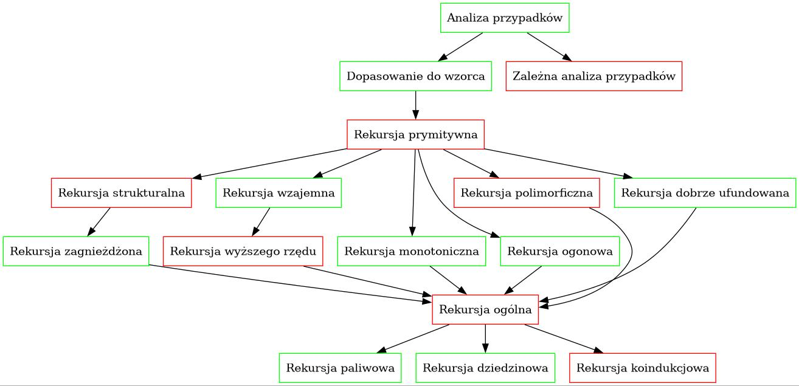

# Rodzaje rekursji

Na obrazku widać różne rodzaje rekursji i techniki jej wykorzystania. Kolor zielony oznacza, że już ten rodzaj opisałem, a czerwony, że jeszcze nie. Strzałka od A do B oznacza, że A jest specjalnym przypadkiem B, lub że B jest techniką realizacji A.

| Nazwa           | Opis                  |
| --------------- | --------------------- |
| Analiza przypadków | Rozróżnianie konstruktorów. Odpowiada enumeracjom, czyli najprymitywniejszym typom induktywnym. |
| Dopasowanie do wzorca | Wiązanie argumentów konstruktorów. |
| Zależna analiza przypadków | Analiza przypadków dla indeksowanych enumeracji. Każdy przypadek determinuje możliwe indeksy. |
| Rekursja prymitywna | Wywołania rekurencyjne na bezpośrednich podtermach. Odpowiada mniej więcej standardowej regule indukcji. |
| Rekursja strukturalna | Wywołania rekurencyjne na głębszych podtermach. Potrzeba customowych reguł indukcji, żeby udowodnić co trudniejsze twierdzenia. |
| Rekursja zagnieżdżona | Przyjazny wariant: dopasowanie wyniku wywołania rekurencyjnego.   Groźniejszy wariant: wywołanie rekurencyjne na wyniku innego wywołania rekurencyjnego. |
| Rekursja wzajemna | Rekursja prymitywna dla typów wzajemnie induktywnych. |
| Rekursja wyższego rzędu | Wywołanie rekurencyjne jest zaaplikowane częściowo. Występuje przy zagnieżdżonych typach induktywnych takich jak drzewo, które ma listę poddrzew. |
| Rekursja monotoniczna | Dobitnie pokazuje, że przez rekursje można definiować nie tylko funkcje zwracające elementy typów bazowych, ale także funkcje zwracające funkcje. Typowe przykłady to funkcja Ackermanna oraz funkcja `merge` w mergesorcie. |
| Rekursja ogonowa | Każde wywołanie rekurencyjne jest ogonowe, a wynik jest gromadzony w pomocniczym akumulatorze. Używana do (asymptotycznego i nie tylko) przyspieszania funkcji. |
| Rekursja dobrze ufundowana | Wywołania rekurencyjne na dowolnych argumentach, które są mniejsze od obecnego argumentu według jakiejś relacji dobrze ufundowanej. |
| Rekursja ogólna | Dozwolone sa wszystkie możliwe postacie wywołań rekurencyjnych. |
| Rekursja paliwowa | Metoda definiowania funkcji ogólnie rekurencyjnych, polegająca na dodaniu jako argumentu licznika "paliwa", które jest spalane przy każdym wywołaniu rekurencyjnym. Żeby uzyskać pożądaną funkcję, trzeba udowodnić, że mamy wystarczająco dużo paliwa. |
| Rekursja dziedzinowa | Metoda definiowania funkcji ogólnie rekurencyjnych, polegająca na tym, że przekształcamy ogólną rekursję z docelowej definicji w rekursję prymitywną na predykacie reprezentującym jej strukturę wywołań rekruencyjnych. Żeby uzyskać pożądaną funkcję, trzeba udowodnić, że każdy argument należy do dziedziny. |
| Rekursja koindukcjowa | Metoda definiowania funkcji ogólnie rekurencyjnych, polegająca na tym, że zawijamy oryginalną przeciwdziedzinę w koinduktywną zawijkę, dzięki której możemy przekształcić wywołania rekurencyjne w wywołania korekurencyjne. |