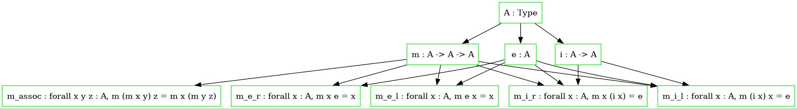

# Rekordy (nie, nie sportowe)

Stan rekordów w Coqu i ogólnie w zasadzie w każdym możliwym języku jest smutny, a chyba mógłby być lepszy. 

Problem z rekordami jest taki, że _typy rekordowe_ (ang. _record types_) są bytami gorszego sortu. Konkretniej rzecz biorąc, istnieją one w metajęzyku (można o nich mówić w języku polskim), ale nie istnieją w języku (nie można w Coqu powiedzieć np. "dla wszystkich typów rekordowych").

Wynika z tego wiele upierdliwieństw, którym można byłoby zaradzić, gdyby typy rekordowe miały pełnię praw obywatelskich. Co to znaczy "pełnia praw"?

Ano, powinien istnieć typ induktywny, który nazwiemy na potrzeby tej notatki `Rec`, a którego elementami byłyby kody, które można interpretować jako typy rekordowe.

Dla przykładu, poniższy typ rekordowy

```coq
Record Sigma (A B : Type) : Type :=
{
    outl : A;
    outr : B;
}.
```

mógłby być interpretacją następującego kodu

```coq
Field "outr" B (Field "outl" A Nil)
```

Szczegóły typu kodów pozostawmy naszej wyobraźni, choć gdyby w Coqu była indukcja-rekursja, to można by go zdefiniować jakoś tak (uwaga: ta definicja nie to samo co powyższy kod, który jest tylko produktem naszej wyobraźni):

```coq
Inductive Rec : Type :=
    | RNil : Rec
    | RCons :
        forall {R : Rec} {P : El R -> Type} {x : El R},
            string -> P x -> Rec
```

gdzie `El` to funkcja interpretująca kody jako faktyczne typy rekordowe.

Ok, formalne duperele na bok. Co fajnego można by robić z tak pomyślanymi rekordami? Tu jest krótka lista (dla ułatwienia, zamiast kodami, będziemy operować typami rekordowymi i konkretną składnią):
- subtypowanie - mając dwa rekordy można łatwo sprawdzić, czy jeden jest podtypem drugiego. Dla przykładu `R = {x : nat, y : bool, z : True}` jest podtypem `R' = {x : nat, y : bool}`, więc `R` można łatwo zrzutować na `R'`, po prostu zapominając pole `z`.
- ustawienie wartości - można robić typy rekordowe z niektórymi polami z góry ustawionymi na określone wartości. Niech `R = {x : nat, y : bool, z : True}`. Moglibyśmy napisać np. `R with x = 42` i dostalibyśmy typ `{x = 42 : nat, y : bool, z : True}`, którego wartościami są w sumie takie same jak typu `{y : bool, z : True}`. Jest to swego rodzaju "częściowa aplikacja" dla rekordów.
- zmiana nazwy - można zmienić nazwę pola na wygodniejszą w danej sytuacji. Niech `R = {x : nat, y : bool}`. Możemy napisać `R renaming (x to n, y to b)` i dostać typ `{n : nat, b : bool}`
- suma - można zsumować dwa typy rekordów bez duplikacji pól, które mają takie same nazwy i typy. Przykład: jeżeli `R = {x : nat, y : bool}` i `S = {x : nat, z : True}`, to `R + S = {x : nat, y : bool, z : True}`.
- przekrój - analogicznie jak wyżej. Przykład: `R przekrój S = {x : nat}`.
- rozszerzenie - operacja podobna do dosumowania singletonowego rekordu. Przykład: `{x : nat, y : bool} with z : True = {x : nat, y : bool, z : True}`.
- usunięcie - wyrzucenie pola z typu rekordowego, np. `{x : nat, y : bool, z : True} \ z = {x : nat, y : bool}`.

Jakie problemy rozwiązują te wszystkie fajne rzeczy? Ano, kilka. Zdefiniujmy sobie najpierw parę przykładowych typów. Niech

```
Refl =
{
    A : Type,
    R : A -> A -> Prop,
    refl : forall x : A, R x x
}

Sym =
{
    A : Type,
    R : A -> A -> Prop,
    sym : forall x y : A, R x y -> R y x
}

Trans =
{
    A : Type,
    R : A -> A -> Prop,
    sym : forall x y z : A, R x y -> R y z -> R x z
}
```

Są to oczywiście typy reprezentujące, odpowiednio, relacje zwrotne, symetryczne i przechodnie na dowolnym typie.

Pierwszy problem Coqowych rekordów jest taki, że ciężko jest konwertować je na klasy. Jeżeli mamy `Refl` jak wyżej, to żeby zrobić typ relacji zwrotnych na liczbach naturalnych, musimy w Coqu napisać coś w stylu `{R : Refl | A R = nat}`, co jest mega niechlujne, a z uniwalentnego punktu widzenia niepoprawne. Konwersja w drugą stronę, czyli z klasy na rekord, jest za to upierdliwa i sprowadza się w zasadzie do zdefiniowania tego rekordu od nowa. Przykład:

```coq
Definition isReflexive
    {A : Type} (R : A -> A -> Prop) : Prop :=
        forall x : A, R x x.

Definition Refl : Type :=
{
    A : Type;
    R : A -> A -> Prop;
    refl : isReflexive R;
}.
```

Niefajnie, co? Szczególnie, gdy nasz rekord ma dużo pól - strata czasu na pisanie bojlerplejtu jest olbrzymia. Problem ten jest rozwiązywany przez ustawianie wartości w typach rekordowych. Przy ulepszonych rekordach typ relacji zwrotnych na liczbach naturalnych możemy uzyskać pisząc `Refl with A = nat`, a `isReflexive` możemy zdefiniować tak: `isReflexive A' R' = Refl with A = A', R = R'`.

Dzięki temu mamy kanoniczny sposób reprezentowania wszystkich możliwych powiązanych pojęć na raz: relacja zwrotna, bycie relacją zwrotną, etc. Oczywiście boilerplejtu nadal jest dość dużo, więc można by się pokusić o automatyczne generowanie wszystkich tych rzeczy, np. na zasadzie, że każdemu polu odpowiada podrekord składający się tylko z tych rzeczy, na których to pole zależy.

Co więcej, ulepszone rekordy nie tylko unifikują Coqowe rekordy i klasy, ale także Coqowe moduły. Są od nich nawet dużo potężniejsze, bo pozwalają na zmiany nazw i inne takie.

Drugi problem Coqowych rekordów to ekstremalna teleskopizacja. Chodzi o to, że intuicyjnie np. grupa to monoid z odwrotnościami, podczas gdy formalnie w Coqu grupa to rekord, w którym jedno pole to monoid, a pozostałe pola to operacja odwracająca oraz odpowiednie prawa.

Jest to problem, bo przy paru takich zagnieżdżeniach żeby zdefiniować rekord trzeba pisać `x := { y := { z := {w := { ...}}}}` i tak dalej, co jest bardzo lipne. Dzięki ulepszonym rekordom można temu zapobiec pisząc po prostu, że grupa to suma monoidu, odwrotności i praw, jak na obrazku:



Trzeci problem jest taki, że ciężko się reużywa Coqowych typów rekordowych przy definiowaniu, np. definicja relacji równoważności wygląda pewnie tak:

```coq
Record Equiv : Type :=
{
    A : Type;
    R : A -> A -> Prop;
    refl : forall x : A, R x x;
    sym : forall x y : A, R x y -> R y x;
    trans : forall x y z : A, R x y -> R y z -> R x z;
}.
```


Jest to oczywiście pewne marnotrawstwo, jeżeli musimy osobno zdefiniować relacje zwrotne, symetryczne i przechodnie. Z ulepszonymi rekordami moglibyśmy po prostu użyć sumy, pisząc `Equiv = Refl + Sym + Trans`.

Czwarty problem to cała masa upierdliwości jeżeli chodzi o funkcje. Przede wszystkim, ciężko robi się częściową aplikację, szczególnie gdy mamy dużo argumentów. Prześledźmy kilka stadiów ewolucji funkcji:
- `f : A * B * C -> D` - możemy postrzegać `f` jako funkcję "wielu zmiennych", reprezentacją dziedziny jest produkt. Częściowa aplikacja wychodzi marnie, bo trzeba napisać np. `fun p : A * B => f (outl p, outr p, c)`
- `f : A -> B -> C -> D` - możemy postrzegać `f` jako funkcję "jednej zmiennej", skuryfikowaną. Częściową aplikację robi się prościej niż ostatnio: `f a`, no chyba że chcemy częściowo zaaplikować któryś z dalszych argumentów, to wtedy nie: `fun a b => f a b c`. Im dalszy argument, tym więcej pisaniny.
- `f : {x : A, y : B, z : C} -> D` - funkcja biorąca wszystkie argumenty zapakowane w (ulepszony) rekord. Częściowa aplikacja jest łatwa dla każdego argumentu, wystarczy (czy raczej wystarczyłoby) napisać coś w stylu `f {z = c}`, żeby uzyskać funkcję typu `{x : A, y : B} -> D`.

Jednocześnie taka reprezentacja funkcji upieka więcej pieczeni na jednym ogniu: mamy argumenty nazwane, opcjonalne, domyślne (w sensie _default_) oraz domyślne (w sensie _implicit_). Co więcej, jeżeli konstruktory typów induktywnych brałyby jako argumenty takie ulepszone rekordy, to dostajemy za darmo całą masę wygodnych rzeczy opisanych w notatce [o składni](składnia.md).

## Tak się da?

No, to da się zrobić takie rekordy, jak wyżej napisano? Nie wiem, ale myślę, że to wszystko wcale nie jest takie groźne jak wygląda, bo wszystko sprowadza się do operacji na kodach, a kody można zdefiniować w języku, który ma indukcję-rekursję, jak np. Agda. Co więcej, są prace opisujące podobne uniwersum kodów dla typów induktywnych (i to nawet takie, które ma kod samo na siebie) i nie ma z tym problemów.